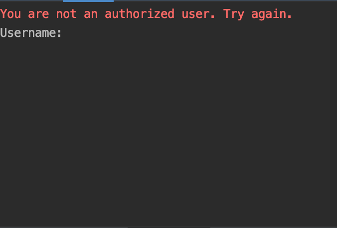
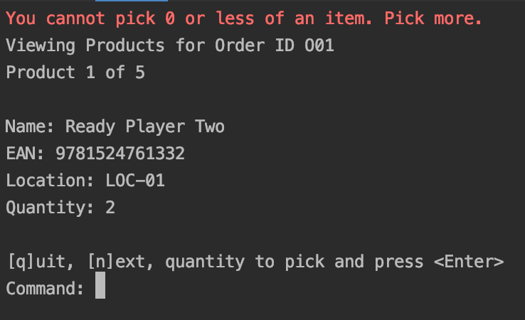

# shop-cli

A tiny shop cli written in Java to allow distribution associates to pick product. 

# Table of Contents 
1. [Dependency Prerequisites](#dependency-prerequisites)
2. [Running the CLI](#running-the-cli)
3. [Supported Flows](#supported-flows)
4. [Error Flows](#error-flows)
5. [Further Thoughts](#further-thoughts)

## Dependency Prerequisites 

- Docker v19
- Java 8

### Backend Server Built and Running 

#### Build the Backend Server
```
docker build -t <REPOSITORY> ./backend/Dockerfile
```
(REPOSITORY can be whatever name you want)

#### Find Available Builds
```
docker image list
```

When you execute this command you should see something like:


#### Run the Backend Server
```
docker run -dp 8080:8080 <REPOSITORY>
```

#### Find the Running Container 
```
docker container list
```

When you execute this command, you should see something like: 


#### Killing the Running Container
```
docker container kill <CONTAINER ID>
```

## Running The CLI

#### Run the (latest) jar 
```
java -jar app/shop-cli.jar
```

#### Build it (if it's not already built) and you made changes
```
./gradlew clean build
```

#### Run new Build with Java
```
java -jar build/libs/shop-cli.jar
```

## Supported Flows

#### Login


#### Order Inquiry


#### Order Product Picking 


#### Summary Screen 


## Error Flows

#### Bad Login


#### Order Inquiry Unsuccessful


#### Order Product - Over Picking 


#### Order Product - Under Picking 


#### Order Product - Invalid Command 


## Further Thoughts

- Testing the Console is very strange.
- At a second glance, I don't like this recursive design. It's complicated to test.
- I didn't keep SR (single responsibility) in mind when designing.
- I should set up an abstract class structure for my screens, so I can maintain the same "Command:" functionality and standardize and displays.
- The screens should be decoupled and the flow not as nested.
  - the flow should have been:
    - auth <- login (this part was done)
    - auth -> inquiry (this part was done)
    - order <- inquiry
    - order -> page view
    - picked order <- page view

